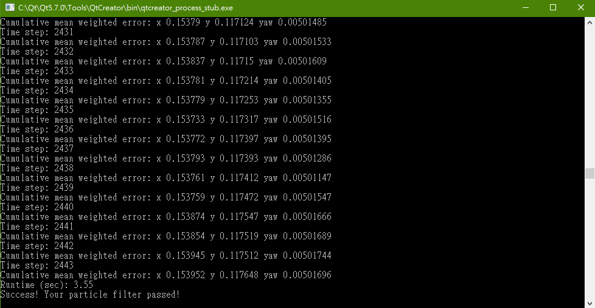

# Localization-Particle-Filter
Udacity Particle Filter Project

This repository contains all the code needed to complete the final project for the Localization course in Udacity's Self-Driving Car Nanodegree.

## Project Introduction

Your robot has been kidnapped and transported to a new location! Luckily it has a map of this location, a (noisy) GPS estimate of its initial location, and lots of (noisy) sensor and control data.

In this project you will implement a 2 dimensional particle filter in C++. Your particle filter will be given a map and some initial localization information (analogous to what a GPS would provide). At each time step your filter will also get observation and control data.

## The Final Results
I've used 10 particles and passed the error and runtime requirements:



One thing I'm going to emphasize is that I used **log-scale** to calculate the multivariant Gaussian pdf. By doing so, precision is preserved much more better than linear scale!

The critical part is log-add function. See codes below:

```c++
double logAdd(std::vector<double> &weights)
{
    double acc=weights[0];
    for (int i=1;i<weights.size();i++)
    {
        double big,little;
        big = (acc>weights[i])?acc:weights[i];
        little = (acc<=weights[i])?acc:weights[i];

        acc = big + log(1+exp(little-big));
    }
    return acc;
}
```
